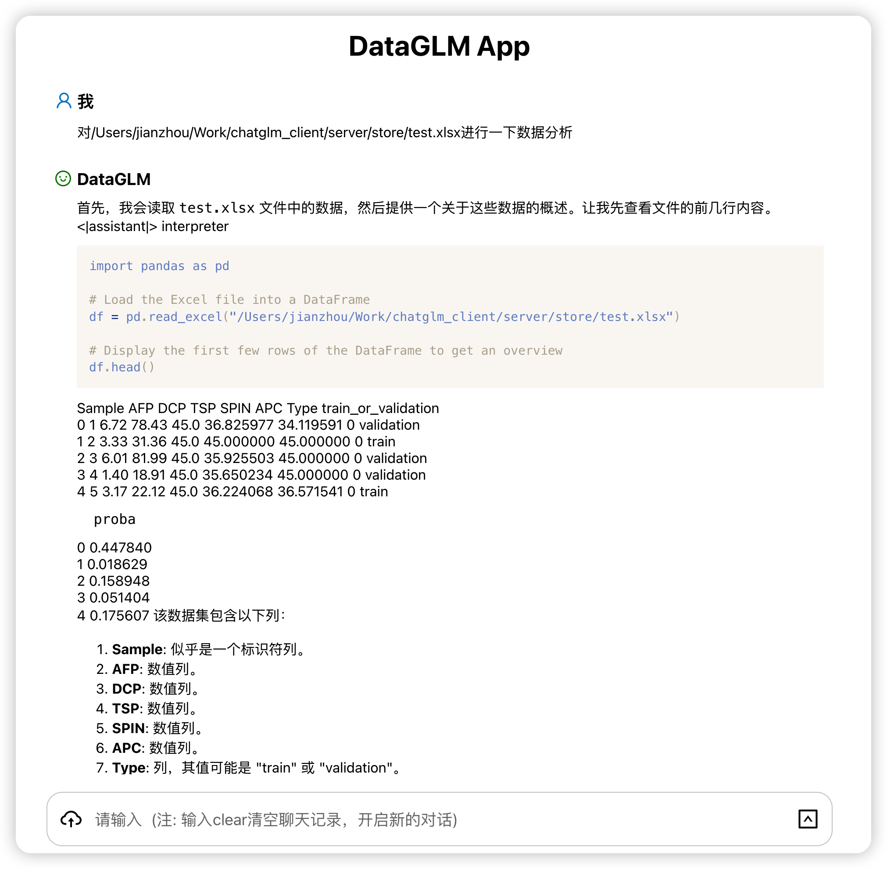

## DataGLM
DataGLM是一个本地化的数据分析和文献阅读项目，解决了数据隐私问题的同时还充分利用了AI的能力，目前项目还在开发中，敬请期待。

目前ChatGPT分析数据能力已经达到了一定的高度，但分析数据必须上传到对方服务器，这样就会有一定的隐私问题，而且数据量也有限制。DataGLM目前实现了将数据分析的能力放在本地，这样就不会有隐私问题，而且数据量也不会有限制，目前这个项目还在开发中，后期DataGLM将专注数据分析和文献阅读能力，敬请期待。



### 使用方式
-------
#### 环境安装
首先需要下载本仓库：
```bash
git clone https://github.com/beautifulsumday/dataglm
cd dataglm
```

pip 安装依赖：
```bash
pip install -r requirements.txt
```

安装jupyter notebook的kernel：
```bash
python -m ipykernel install --user --name dataglm --display-name "Python (dataglm)"
```

运行
```bash
flask --app server/main run --port 60006
```

### 项目结构
-------

```
dataglm
├── dist # 前端打包后的文件
├── frontend # 前端代码
├── server # 后端代码
│   ├── store # 如果自己部署的话可以不上传文件，该文件夹就用不上
│   ├── main.py # 后端入口
│   ├── kernel.py # jupyter notebook的kernel
│   ├── authentication.py # 用户认证
├──.env # 环境变量，记录了服务器端的GPT api
├── babel.config.js # babel配置文件
├── package.json # npm配置文件
├── README.md # 项目说明
├── requirements.txt # python依赖
├── webpack.config.js # webpack配置文件
```


